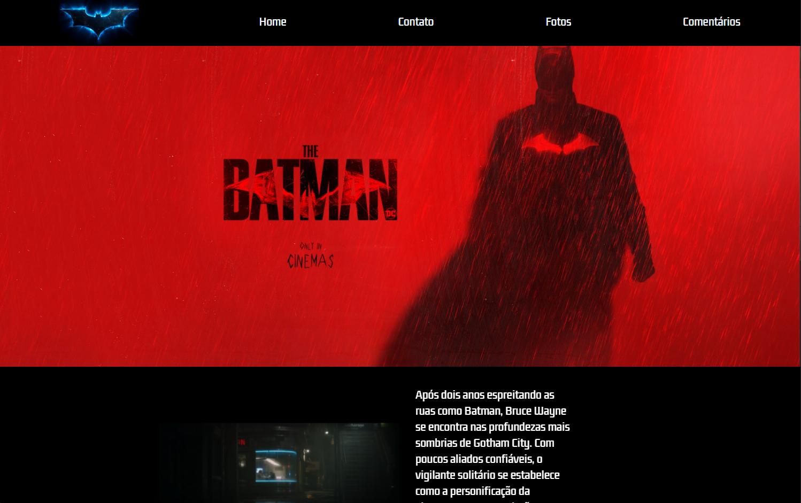

# 🦇 The Batman (2022) - Site Promocional

> Site promocional e venda de ingressos para o filme The Batman (2022), desenvolvido com HTML e CSS, oferecendo uma experiência responsiva e imersiva aos fãs.



## 📋 Sobre o Projeto

Site desenvolvido para promover o filme The Batman (2022), oferecendo aos fãs informações sobre o filme, galeria de fotos, compra de ingressos e interação através de comentários. O projeto foi construído com foco em responsividade, garantindo uma excelente experiência em diferentes dispositivos.

## 🚀 Funcionalidades

- **Página Principal**
  - Trailer oficial do filme
  - Sinopse detalhada
  - Cards interativos dos personagens principais
  
- **Galeria de Fotos**
  - Carrossel de imagens do filme
  - Cenas marcantes
  - Bastidores
  
- **Área de Contato**
  - Formulário para contato
  - Comunicação direta com a equipe

- **Seção de Comentários**
  - Avaliações dos espectadores
  - Experiências compartilhadas
  - Feedback do público

## 🛠️ Tecnologias Utilizadas

- **HTML5** - Estruturação do conteúdo
- **CSS3** - Estilização e responsividade
  - Flexbox
  - Media Queries
  - Animações

## 📁 Estrutura do Projeto

```
📦 ProjetoBatman
 ┣ 📂 midia
 ┃ ┗ 📂 (arquivos de mídia do projeto)
 ┣ 📜 index.html
 ┣ 📜 style.css
 ┣ 📜 fotos.html
 ┣ 📜 fotos.css
 ┣ 📜 contato.html
 ┣ 📜 contato.css
 ┣ 📜 comentarios.html
 ┗ 📜 comentarios.css
```

## 💻 Como Executar o Projeto

1. Clone o repositório
```bash
git clone https://github.com/nicolasbaggio/ProjetoBatman.git
```

2. Abra o arquivo `index.html` em seu navegador

ou

Acesse o site diretamente em: [The Batman Site](https://nicolasbaggio.github.io/ProjetoBatman/)

## 📱 Responsividade

O site é totalmente responsivo, adaptando-se a diferentes tamanhos de tela:
- Desktop
- Tablet
- Smartphone

## 👨‍💻 Autor

Nicolas Baggio
- [GitHub](https://github.com/nicolasbaggio)
- [LinkedIn](https://www.linkedin.com/in/nicolasbaggio/)

## 📄 Licença

Este projeto está sob a licença MIT - veja o arquivo [LICENSE](LICENSE) para detalhes.

---

### 🦇 "Vingança com estilo"

⭐ Se você gostou deste projeto, não se esqueça de deixar uma estrela!
